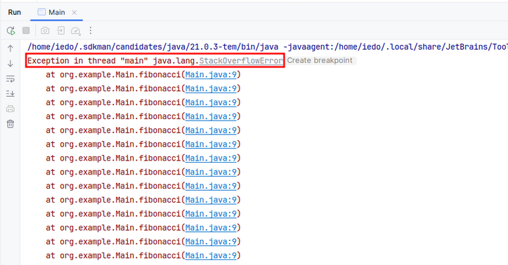

# Recursividade

## O que é?

Recursão é o momento em que uma função chama a si mesma.

<figure><figcaption><p>catei desse site: <a href="http://geraldoferraz.blogspot.com/2011/11/recursividade.html">http://geraldoferraz.blogspot.com/2011/11/recursividade.html</a></p></figcaption></figure>

Exemplo em java:

```java
// Função que vai fazer uma contagem do número N até 0
public void contagemRegressiva(int number){
    if (number < 0) {
        return;
    }
    System.out.println(number);
    contagemRegressiva(number - 1); // <- Recursão
}
```


## Estrutura de uma recursão (macetes)

Eu prefiro começar sempre com a condição pra essa recursão parar, o _base case._ acho bem mais fácil de entender.

Um exemplo na prática é o [Leetcode 100. Same Tree](https://leetcode.com/problems/same-tree/)

Nele precisamos comparar se duas árvores binárias são idênticas. Minha solução no fim foi essa:

```java
class Solution {
    public boolean isSameTree(TreeNode p, TreeNode q) {
        // Base case 01: Se ambos os nós forem nulos, estamos no final da árvore, então são iguais. 
        if (p == null && q == null){
            return true;
        }
        // Base case 02: Se só um nó for nulo, as árvores são diferentes.
        if (p == null || q == null){
            return false;
        }
        // Base case 03: Se os valores de ambos os nós forem diferentes, a árvore é diferente.
        if (p.val != q.val){
            return false;
        }
        // Repete!
        return this.isSameTree(p.left, q.left) && this.isSameTree(p.right, q.right);
    }
}
```


Curiosidade: esse algoritmo que fiz com recursão se chama  Depth-First Search, ele percorre uma árvore toda fazendo uma busca em profundidade. Em breve faço um artigo com algoritmos de busca :)


## Quando que eu uso?

Parecido com os loops, a recursão vai ser usada pra resolver problemas sequenciais como o fibonacci, fatoriais, algoritmos de busca em árvores, ordenações, algoritmos usando divide-and-conquer como quicksort...


O problema é que tem um custo. E o pior, o custo só é descoberto de 2 formas:

1. Tomando um erro na fuça sem saber o que fazer
2. Ouvir de alguém que já tomou um erro na fuça sem saber o que fazer

Vamos ver um exemplo de um [fibonacci](https://brasilescola.uol.com.br/matematica/sequencia-fibonacci.htm) recursivo:

```java
// Retornará o número na posição x da sequência de fibonacci
public long fibonacci(int x) {
  if (x <= 1 ) {
    return x;
  }

  return fibonacci(x - 1) + fibonacci(x - 2);
}
```

Se a gente chamar essa função com `x = 2` retorna `1`, `x = 4` retorna `3`  e  `x = 6` retorna `8`

Mas e se eu exagerar e chamar enviando  10 milhões? A resposta é um erro esquisito pra quem nunca viu.

<figure><figcaption><p>Esse nome é familiar...</p></figcaption></figure>

Fora o `StackOverflowError`, há também várias linhas gritando&#x20;

```
at org.example.Main.fibonacci(Main.java:9)
at org.example.Main.fibonacci(Main.java:9)
at org.example.Main.fibonacci(Main.java:9)
at org.example.Main.fibonacci(Main.java:9)
```

### Por que minha recursão não funciona com muitas iterações?

Toda vez que chamamos uma função, ela é guardada numa stack e liberada quando ela retorna. Essa é a _Call Stack (_pilha de chamadas).&#x20;

Daí você pode imaginar o que seria esse Stack Overflow, ele vai surgir quando a call stack estiver cheia, a cada iteração é mais um espaço ocupado na call stack. Você pode até aumentar o tamanho da stack para seu código passar com algumas configurações, mas é só uma solução temporária.

```java
public static long fibonacci(int x) {
  if (x <= 1 ) {
    // 3) Somente nesse return que a função sai da callstack.
    return x;
  }
  
  // 2) Toda vez que a função fibonacci chama ela mesma
  // Essas 2 chamadas são guardadas na callstack
  return fibonacci(x - 1) + fibonacci(x - 2);
}

public static void main(String[] args){
  fibonacci(10_000_000); // 1) primeira chamada indo pra callstack
}
```

Recomendo esse [link](https://developer.mozilla.org/pt-BR/docs/Glossary/Call\_stack) pra saber mais sobre o que é a call stack.

#### A Stacktrace

```
at org.example.Main.fibonacci(Main.java:9)
at org.example.Main.fibonacci(Main.java:9)
at org.example.Main.fibonacci(Main.java:9)
at org.example.Main.fibonacci(Main.java:9)
```

\
Toda vez que uma exceção é lançada, a jvm percorre a pilha de chamadas (call stack), rastreando as funções chamadas até chegar à primeira delas. Então, cada uma dessas linhas indica que a exceção ocorreu na linha 9 do arquivo `Main.java.`


Se debugarmos pelo IntelliJ, podemos ver cada chamada na call stack.

<figure><figcaption></figcaption></figure>

Então, em resumo, o processo é:

1. Função é chamada
2. Ela é guardada na call stack
3. Cada função que ela chama também é guardada na call stack
4. Quando o que tiver lá dentro dela terminar (inclusive funções que ela chama) e ela der um return, sai da call stack.

### Como contornar o Stack Overflow?

Então, esse é o trade-off de uma função recursiva, se ela fizer muitas iterações a callstack pode estourar. É daí que a gente troca para um loop e para de jogar chamadas na stack.

```java
public static long fibonacci(int x){              
   if (x <= 1){                                
       return x;                                         
   }

   long previous = 0, current = 1;                       
   for(long position = 1; position <= x; position++){    
       long next = previous + current;                   
       previous = current;                               
       current = next;                                   
   }

   return current;                                       
}                  

// Pode testar que pelo menos com x = 10 milhões isso roda                                       
```

